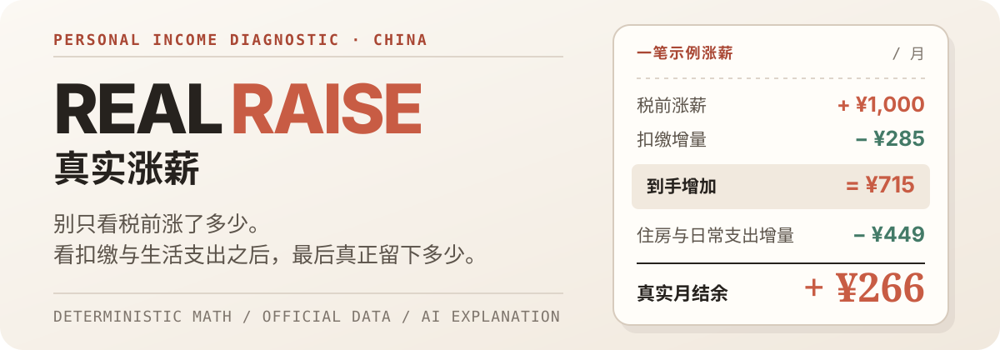
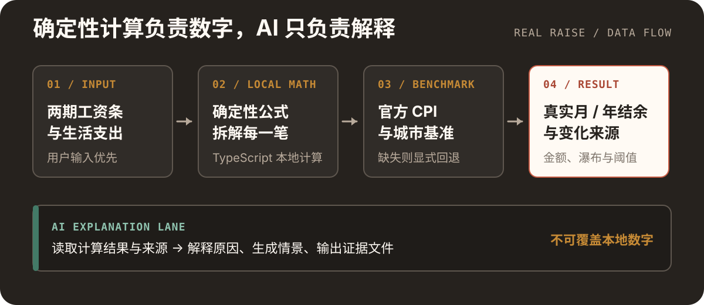

<p align="center">
  
</p>

<p align="center">
  <a href="https://plain-wind-ae46.yefuyou2333.workers.dev/"><strong>在线体验 →</strong></a>
  ·
  <a href="#30-秒上手">30 秒上手</a>
  ·
  <a href="#它如何算">计算方法</a>
  ·
  <a href="#数据可信度">数据口径</a>
</p>

<p align="center">
  <code>React</code> <code>TypeScript</code> <code>Cloudflare Workers</code> <code>InfiniSynapse</code>
</p>

Real Raise 是一个面向中国职场人的个人收入诊断工具。输入现在与下一阶段的工资、扣缴和生活支出，它会回答一个比“涨了多少”更实际的问题：

> 经过个税、社保公积金和生活支出之后，这次涨薪每月真正还能留下多少？

所有核心金额都由本地确定性公式计算。AI 只读取计算结果与来源做解释，不负责改数字。

<p align="center">
  
</p>
<p align="center"><sub>工资条模式的真实界面；示例数据一键填入，可逐项覆盖。</sub></p>

## 先看懂这一笔涨薪

点击“工资条 → 填入示例”，Real Raise 会把一笔税前涨薪沿同一条账本拆开：

| 账本变化 | 对真实月结余的影响 |
| --- | ---: |
| 税前工资增加 | `+ ¥1,000` |
| 个税、社保与公积金增加 | `− ¥285` |
| 真正到手增加 | `= ¥715` |
| 住房与日常支出增加 | `− ¥449` |
| **最终每月多留下** | **`+ ¥266`** |

养老保险与住房公积金会单独标注为“未来保障与账户积累”，不会被笼统写成“消失”。

## 它能做什么

- **两种收入入口**：直接比较到手收入，或逐项录入两期工资条。
- **拆清涨薪去向**：展示个税、养老、医疗、失业、公积金与其他扣缴的变化。
- **把生活成本算进去**：支持住房支出与六类日常消费，并允许手动覆盖价格变化率。
- **对照公开基准**：使用全国与城市 CPI、收入和消费数据；缺失城市不会被插值伪造。
- **先给结论，再解释原因**：同时输出月度/年度结余、维持原生活所需月入和变化瀑布。
- **可选 AI 解读**：InfiniSynapse 根据确定性结果与来源生成解释、情景和证据产物。

## 它如何算

<p align="center">
  
</p>

核心链路只有一条：

```text
税前收入
  − 个税、社保、公积金与其他扣缴
= 真正到手
  − 住房与日常生活支出
= 可支配结余
```

关键实现：

- [`src/domain/salarySlip.ts`](./src/domain/salarySlip.ts)：工资条估算、扣缴汇总与到手计算。
- [`src/domain/livingCost.ts`](./src/domain/livingCost.ts)：生活成本、购买力与结余变化。
- [`worker/core.mjs`](./worker/core.mjs)：请求校验、签名会话、限流与额度保护。
- [`worker/infiniSynapse.mjs`](./worker/infiniSynapse.mjs)：AI 解释层适配，不参与核心金额计算。

## 30 秒上手

### 在线体验

1. 打开 [Real Raise 在线版](https://plain-wind-ae46.yefuyou2333.workers.dev/)。
2. 在收入区切换到 **工资条**，点击 **填入示例**。
3. 查看“税前 → 到手”扣缴拆解、月/年结余与维持原生活所需月入。
4. 使用存档回放、Mock 演示，或登录 InfiniSynapse 生成个性化解读。

### 本地运行

需要 Node.js 22+。

```bash
git clone https://github.com/yefuyou/real-raise.git
cd real-raise
npm ci
npm run dev
```

默认本地开发使用 Mock 模式，不需要 API Key，也不会消耗平台额度。

```bash
npm test             # 确定性计算、数据与回放断言
npm run worker:test  # Worker 边界、会话、限流与额度保护
npm run build        # TypeScript 严格检查 + 生产构建
npm run worker:check # Cloudflare 配置干跑
```

## 产品能力

| 模块 | 用户得到什么 | 当前状态 |
| --- | --- | --- |
| 到手模式 | 最短路径比较两期可支配结余 | 可用 |
| 工资条模式 | 两期税前、个税、社保、公积金与到手拆解 | 可用 |
| 生活支出 | 住房 + 六类日常消费的个性化变化 | 可用 |
| 城市与历史基准 | 全国、北京、上海、深圳、合肥及 2021–2025 历史参考 | 可用，按数据覆盖显式回退 |
| AI 演示 | Mock 状态机与真实任务存档回放 | 免登录可用 |
| AI 真实链路 | SSE 进度、三份产物、缓存与可读降级 | 需平台登录 |
| Cloudflare 服务层 | 静态站与 `/api/*` 同源、Secret 隔离、限流与每日硬上限 | 已接入 |

## 数据可信度

每一个数都属于以下四类之一：

| 标签 | 含义 |
| --- | --- |
| `verified` | 从公开统计来源核验的原值 |
| `derived` | 基于明确公式得到的派生值 |
| `user-input` | 用户输入，不伪装成官方数据 |
| `forecast` | 显式标注假设的情景预测 |

- **2026 CPI 边界**：使用 2026 年上半年已公布数据作为观察基准，不冒充全年或下一年度官方预测。
- **城市数据三档**：分类数据完整时使用城市基准；只有综合 CPI 时只作价格背景；缺失时回退全国基准并明确提示。
- **住房支出优先级**：始终以用户实际输入为准，城市“居住类 CPI”不替代房租或房贷。
- **官方未公布就留空**：不通过插值或相邻年份补齐缺失事实。

详见 [`DATA_DICTIONARY.md`](./docs/DATA_DICTIONARY.md) 与 [`CITY_BENCHMARK_CONTRACT.md`](./docs/CITY_BENCHMARK_CONTRACT.md)。

## AI 与安全边界

InfiniSynapse 是解释层，不是计算器。当前用户路径是 Partner SSO、真实任务回放与本地 Mock；平台不可用、达到额度或没有登录时，确定性算表仍然可用。Worker 保留的短时会话接口仅用于兼容历史部署，不属于产品入口。

项目不会提交或上传：

- InfiniSynapse API Key、Partner Secret、评委口令及其他 Secret；
- 用户工资条、银行流水或个人扣缴明细；
- 未脱敏的任务日志；
- 没有来源、年份与统计范围的数据。

生产部署由同一个 Cloudflare Worker 托管静态资源与 API。项目 Key 只存在 Worker Secret；接口同时设置短时会话、请求校验、速率限制、每日硬上限和并发保险丝。

## 文档入口

| 文档 | 用途 |
| --- | --- |
| [`DEPLOYMENT.md`](./docs/DEPLOYMENT.md) | Cloudflare 部署、Secrets 与发布检查 |
| [`INFINISYNAPSE_INTEGRATION_BOUNDARY.md`](./docs/INFINISYNAPSE_INTEGRATION_BOUNDARY.md) | 确定性计算与 AI 解释的职责边界 |
| [`INFINISYNAPSE_TASK_CONTRACT.md`](./docs/INFINISYNAPSE_TASK_CONTRACT.md) | 任务输入、进度事件与产物契约 |
| [`PAYSLIP_UX_SPEC.md`](./docs/PAYSLIP_UX_SPEC.md) | 工资条估算、口径与交互方案 |
| [`DATA_DICTIONARY.md`](./docs/DATA_DICTIONARY.md) | 数据来源、字段与标签口径 |
| [`SUBMISSION_MATERIALS.md`](./docs/SUBMISSION_MATERIALS.md) | 比赛演示与提交材料 |

## 项目背景

Real Raise 参加 [InfiniSynapse × CSDN Vibe Coding 泛数据分析应用开发大赛](https://infinisynapse.cn/contest/vibe-coding)。它不做宏观数据大屏，而是争取在 30 秒内回答：

> 这次涨薪，经过扣缴和生活支出之后，真正留在我手里的还有多少？
