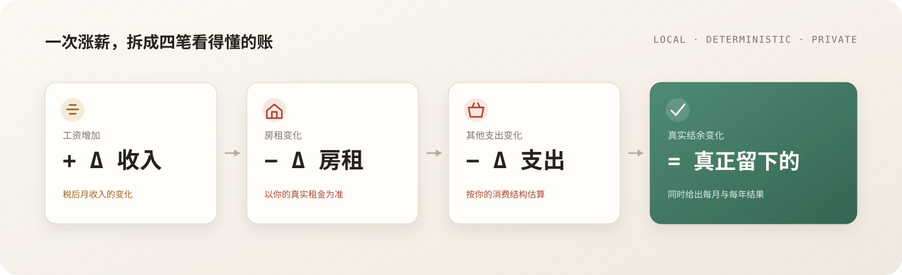

# 涨薪还剩多少？

## Real Raise

> 你的工资涨了，生活真的变宽裕了吗？

一个面向中国城市租房上班族的个人购买力分析工具。

输入当前与明年的税后收入、房租和生活支出，Real Raise 会把“涨薪”拆成一笔看得懂的账：工资增加了多少、房租吃掉了多少、其他生活成本变化了多少，以及你需要赚到多少才能维持现在的生活水平。

<p align="center">
  
</p>

---

## 为什么做它

“涨薪 5%”听起来不错，但如果房租和日常开支涨得更快，工资条上的增加并不等于生活真正变好。

Real Raise 不只展示一个宏观 CPI 数字，而是把官方统计基准和用户自己的真实房租、消费结构放在一起，回答一个更具体的问题：

> **扣掉生活成本之后，我明年到底会多剩多少钱？**

## 它怎么算



核心金额全部在本地用确定性公式计算；宏观统计只提供背景参照，不会覆盖你的真实收入、房租和支出。

## 现在可以体验什么

- 输入当前/明年税后月收入
- 输入当前/明年月租
- 输入不含房租的其他生活支出
- 调整其他支出预计上涨率
- 计算真实购买力变化
- 查看每月、每年结余变化
- 计算涨薪被房租吃掉的比例
- 计算维持原生活水平所需的月收入
- 查看“工资 → 房租 → 其他支出 → 最终结余”的变化路径
- 使用三个预设案例快速体验
- 查看 2021–2025 年国家统计局历史收入、消费和 CPI 基准
- 查看数据来源、统计范围和口径说明

## 产品原则

### 数字由确定性公式负责

所有核心金额和购买力指标由 [`src/domain/livingCost.ts`](./src/domain/livingCost.ts) 计算，不交给模型自由发挥。

### 真实房租优先

用户输入的真实房租优先于宏观统计数据。国家统计局的“居住”类 CPI 只作为背景参照，不冒充某一套房子的真实租金变化。

### AI 负责解释，不负责改数字

后续接入 InfiniSynapse 后，AI 只负责解释、对比和生成生活成本情景，不能重新计算或覆盖本地数字。

### 默认不消耗平台额度

当前默认使用本地计算和 Mock 解读，不调用 InfiniSynapse。真实分析将采用用户自带账号/额度模式，避免公共访问消耗项目方额度。

## 当前状态

| 模块 | 状态 |
| --- | --- |
| 本地确定性计算 | 已完成 |
| 2021–2025 官方历史数据 | 已完成并核验 |
| 来源抽屉与历史基准对比 | 已完成 |
| 前端 Mock 任务状态流 | 已完成 |
| InfiniSynapse 真实后端 | 接入中 |
| 公网部署 | 待完成 |

## 本地运行

```bash
npm install
npm run dev
```

类型检查与构建：

```bash
npm run verify
npm run build
```

## 数据与文档

- [项目计划与分工](./docs/PROJECT_PLAN.md)
- [分析维度与产品边界](./docs/ANALYSIS_DIMENSIONS.md)
- [历史官方数据档案](./docs/DATA_SOURCES_HISTORICAL.md)
- [数据与计算口径](./docs/DATA_SOURCES_2025.md)
- [InfiniSynapse 接入边界](./docs/INFINISYNAPSE_INTEGRATION_BOUNDARY.md)
- [哈吉米前端交接说明](./docs/HAJIMI_FRONTEND_HANDOFF.md)
- [部署与公开体验计划](./docs/DEPLOYMENT.md)

## 技术结构

```text
React + TypeScript + Vite
          │
          ├── 本地确定性计算
          │     └── livingCost.ts
          │
          ├── 官方历史基准
          │     └── officialHistorical.ts
          │
          ├── 前端 Mock 任务流
          │     └── apiClient.ts
          │
          └── 计划中的真实接入
                └── 本项目后端 → InfiniSynapse Server API
```

真实接入时，浏览器只请求本项目后端；InfiniSynapse API Key、任务连接和供应商任务 ID 均留在服务端，不进入前端构建产物。

## 安全边界

不会提交以下内容：

- InfiniSynapse API Key
- `.env` 文件
- 用户工资、房租、银行流水等个人数据
- 未脱敏的任务日志
- 未核验的统计数字

## 比赛信息

本项目参加 [InfiniSynapse × CSDN Vibe Coding 泛数据分析应用开发大赛](https://infinisynapse.cn/contest/vibe-coding)。

目标不是把生活做成一张复杂大屏，而是在 30 秒内让用户看懂：

> **这次涨薪，最后真正留在我手里的还有多少？**
