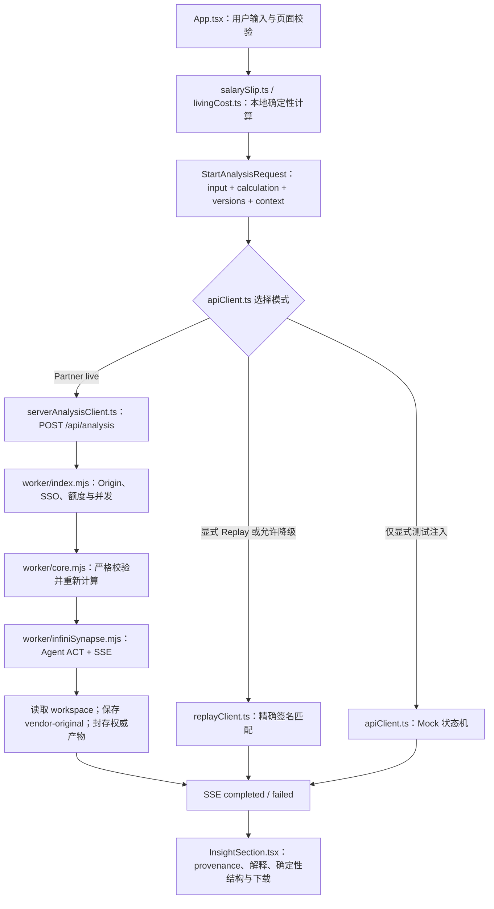

# Real Raise 真实请求生命周期

> 状态：Current as observed
> 基线：`d25bb6b`
> 本文只画能映射到当前文件和函数的链路。

## 1. 总览



关键原则：

- 页面即时数字由前端公式负责。
- live 任务的服务端权威数字由 Worker 再算一次。
- Agent 只收到已经冻结的结果与诊断包。
- 供应商同名数值文件不会直接成为正式凭证。
- Replay 的供应商正文是历史原件，当前数字是本地适配结果，两者必须同时标注。

## 2. 节点逐项映射

| 节点 | 文件 / 函数 | 输入 | 输出 | 错误与边界 |
| --- | --- | --- | --- | --- |
| 收入与支出输入 | `src/App.tsx` | 到手或工资条、住房、日常支出、城市 | `ScenarioInput`、可选 `PayslipSummary` | 页面验证非负/完整性；输入不持久化 |
| 工资条计算 | `src/domain/salarySlip.ts` | 税前、个税、社保、公积金、其他扣缴 | 两期到手、扣缴变化、未来账户变化 | 比例估算只是预填；城市上下限未实现 |
| 生活结余计算 | `src/domain/livingCost.ts::calculateLivingCost` | 两期到手、住房、日常支出、涨幅/覆盖值 | `LivingCostResult` | 页面核心数字源 |
| 请求组装 | `App.tsx` → `InsightSection.tsx` | input、calculation、city、detailed、payslip、model | `StartAnalysisRequest` | `calculationVersion = living-cost.v2` |
| 模式路由 | `src/api/apiClient.ts::startAnalysis` | request、`useMock`、server config、execution mode | task id | live 启动失败可精确 fallback Replay；不 fallback Mock |
| live transport | `src/api/serverAnalysisClient.ts::startServerAnalysis` | Partner mode、model、不透明 auth | 持有 SSE Response 的内存 task | POST 一次即开始 stream；刷新丢失 |
| SSO/准入 | `worker/index.mjs` | Origin、cookie/bearer session | Partner user、用户 API Key（仅服务端） | 无授权 401；限流/额度/并发返回可读 code |
| 服务端复算 | `worker/core.mjs::validateAnalysisRequest` | 不可信 client request | validated request + Worker calculation | 拒绝未知字段与伪造城市上下文；忽略 client calculation |
| 诊断上下文 | `buildAnalysisContext`、`buildDiagnosticPacket` | validated request | versioned context、driver、scenario | 模型不接收自由 prompt |
| Agent 启动 | `worker/infiniSynapse.mjs::runInfiniSynapseAnalysis` | context prompt、用户 Key、model | vendor task id、SSE partial/final | 强制 ACT；意外 plan response 自动切 ACT |
| 产物读取 | 同上 | vendor workspace | previews / stream fallback | explanation 缺失时可用 completion text；两者均无则 failed |
| 权威封存 | `sealAuthoritativeArtifacts` | vendor previews + Worker request | 正式七类文件 + `vendor-original-*` | 正式数值以 Worker 为准 |
| live 展示 | `InsightSection.tsx` | SSE events | status、解释、结构化诊断、provenance | structured insight 若服务端未给则前端确定性生成 |
| Replay 匹配 | `replayClient.ts::findReplayForRequest` | 当前请求签名 | replay task | 仅 exact match；四个包均为旧任务 |
| Replay 输出 | `subscribeReplayTask` | replay package + 当前 request | 历史正文 + 当前确定性产物 | 刷新丢失 task；显示旧口径警告 |
| Mock | `apiClient.ts::mockStartAnalysis` | 显式 `useMock` | 本地模板事件 | 无当前产品入口 |

## 3. Schema 与版本

### 3.1 `StartAnalysisRequest`

定义：`src/api/realRaiseContract.ts`

关键字段：

```text
input
calculation
calculationVersion
cityContext
locale
includeInsight
inputMode
incomeInputMode
detailedBreakdown?
payslipSummary?
analysisModel?
```

信任边界：

- `input`：用户事实，Worker 验证范围后使用。
- `calculation`：客户端结果，只供传输/本地 UI；Worker live 不信任。
- `cityContext`：客户端选择，但 Worker 与内置可信城市数据逐字段对账。
- `detailedBreakdown`：Worker 汇总六类当前/下一阶段金额后重建 other spend。
- `payslipSummary`：Worker 只验证形状和范围，不重新计算。

### 3.2 版本

| 契约 | 当前值 |
| --- | --- |
| 计算 | `living-cost.v2` |
| Prompt | `diagnosis.v2.1-agent-act` |
| Context | `real-raise.context.v2` |
| 诊断包 | `real-raise.diagnostic-packet.v1` |
| Scenario matrix | `real-raise.scenario-matrix.v1` |
| Manifest | `real-raise.analysis.v2` |
| Replay | `replay.v2` / `replay-manifest.v2` |

`replay.v2` 只表示双请求、兼容声明和原件 hash 已审计，不表示历史任务使用当前 Prompt。

## 4. 确定性数字冻结与模型边界

### 4.1 前端

`App.tsx` 每次输入变化都调用：

- `calculateSalarySlip()` 或工资条估算；
- `calculateLivingCost()`；
- 结果卡、瀑布图、诊断链直接读取该结果。

模型正文没有改变这些 state 的 setter。

### 4.2 Worker

`validateAnalysisRequest()`：

1. 拒绝未知顶层字段和自由 prompt。
2. 校验城市上下文必须与 Worker 内置数据一致。
3. 若是 detailed mode，重新汇总六类支出。
4. 用 Worker 自己的 `calculateLivingCost()` 重算。
5. 把结果写入 `deterministic_calculation`、driver ranking、scenario matrix。

### 4.3 Agent

`buildPrompt()` 明确要求：

- 智能体 ACT 模式；
- 实际生成 `explanation.md`；
- 不重新计算或修改权威金额；
- 不进行投资、借贷、辞职建议；
- 不使用 web/browser。

代码会处理供应商意外返回 `plan_mode_response`：更新自动批准设置、切到 ACT、发送继续执行响应。

### 4.4 产物

如果供应商生成 `evidence.csv` 或 `analysis-manifest.json`，先改名为：

```text
vendor-original-evidence.csv
vendor-original-analysis-manifest.json
```

随后 Worker 生成正式：

```text
explanation.md
evidence.csv
analysis-manifest.json
driver-ranking.csv
scenario-matrix.csv
scenario-matrix.json
share-summary.md
```

当前缺口：Worker manifest 的 `artifactContract` 漏列 `scenario-matrix.json`，浏览器 manifest 则列出它。

## 5. 错误、fallback 与可见状态

### 5.1 Worker 错误

`worker/index.mjs::errorResponse()` 返回：

```json
{
  "error": {
    "code": "…",
    "message": "…",
    "fallbackAllowed": true
  }
}
```

常见失败：

- Origin 不允许；
- live 未启用；
- Partner session 缺失或过期；
- 每日额度用完；
- 并发占用；
- 供应商限流/鉴权/超时；
- 输入或城市上下文不可信。

### 5.2 live → Replay

只有启动阶段的 `ServerAnalysisUnavailable` 且 `fallbackAllowed = true` 会触发自动精确 Replay 查找。进入 SSE 后的 failed event 不自动改为 Replay。没有路径会自动进入 Mock。

### 5.3 UI 状态

`InsightSection` 可显示：

```text
idle → queued → running → completed
                    ↘ failed
                    ↘ cancelled
completed + input changed → completed-stale
```

但实现与目标状态机仍有差距：

- 重新开始会立即清空旧 completed，而非保留到新成功。
- refresh 不会恢复 queued/running/completed task。
- active server task 在 unmount 时被 abort。

## 6. 缓存、幂等、恢复与隔离

| 能力 | Cloudflare Worker 生产链 | 备用 Node server | Replay |
| --- | --- | --- | --- |
| 同输入结果缓存 | 无 | 100 条内存 cache | 浏览器重新读取静态包 |
| pending 去重 | 无 | 有 | 签名只用于匹配 |
| task GET | 无 | 有 | 无 |
| refresh 恢复 | 无 | 服务端 task 尚在时理论可查，但 UI 不接 | 无 |
| continue 同 task | 无 | 路由存在 | 无 |
| 持久化 | SSO/usage 在 Durable Object；analysis task 不持久化 | 无 | 静态 replay 包持久 |
| 用户隔离 | Partner user scope + 独立 session | 单 project key，无用户隔离 | 公共只读 |
| 取消 | abort + vendor best effort cancel | cancel route | 本地标 cancelled |

“SSO session 持久”不能推导出“Agent task 可恢复”；它们是两套状态。

## 7. 日志与关联

Worker JSON 日志字段包括：

```text
requestId
outcome
durationMs
analysisMode
attribution
vendorTaskId
calculationVersion
cityCode
```

优点：

- 可从一次请求追到供应商 task id。
- 可区分 Partner/Judge 与公式版本。

缺口：

- 没有 deployment commit。
- 没有持久 task record。
- 没有安全的匿名用户/session correlation id。
- 浏览器 task id 只在内存。

## 8. 三输入数字 contract test

执行：

```bash
npm run audit:outputs
```

该脚本从三个现有 replay 读取固定输入，直接加载真实 TypeScript 前端公式源码，并与 Worker、Replay 当前请求、两套 CSV/Manifest 对账。

它证明确定性出口目前一致，不证明：

- 当前模型正文正确；
- 历史 vendor 原件采用当前公式；
- live 网络、额度、SSO 归因无故障。

## 9. 两个故障注入设计

### FI-01：live 启动失败与降级透明度

目的：确认失败不会被 Mock 冒充，并验证 Replay 是否只有 exact match 才启用。

步骤：

1. 在 Worker 测试中让 `/api/analysis` 分别返回 401、429，`fallbackAllowed = true`。
2. 用一个能命中 replay 的固定请求和一个不能命中的请求各执行一次。
3. 断言命中时最终 provenance 为 `replay`、显示 vendor task id/录制时间/旧口径警告。
4. 断言未命中时 UI 是 failed，且没有 `local-template` / mock provenance。
5. 断言旧 completed report 在新 live 失败后仍可查看。

当前状态：

- 1–4 有零散代码/单元证据，但没有完整 UI 测试。
- 第 5 项当前实现会失败，因为开始新任务时先清空旧报告。

### FI-02：供应商完成但 workspace 产物缺失

目的：确认 Agent 执行失败不会被包装成“已核验产物成功”。

步骤：

1. 模拟供应商发出 completion，但 `getTaskWorkspace` 无 `explanation.md`。
2. 若 final stream 有文本，断言完成事件 `artifactStatus = stream-fallback`，且 UI 明确说明非 workspace verified。
3. 若 final stream 也为空，断言事件为 failed，不能生成伪 explanation。
4. 提供伪造 vendor evidence/manifest，断言它们被保存为 `vendor-original-*`，正式文件仍为 Worker 数字。

当前状态：

- Worker 测试已覆盖产物封存和 `stream-fallback` manifest 字段。
- 未覆盖两个缺失分支的端到端 SSE/UI 展示。

## 10. 接管者最小验证顺序

```bash
node --version                 # 必须 22+
npm ci
npm run verify
npm test                      # 同时检查退出码与 FAIL 行，不能只看末尾绿字
npm run audit:outputs
npm run worker:test
npm run server:test           # 只证明备用路径，不代表生产
npm run build
npm run worker:check
```

然后进行只读线上核验：

1. 记录 commit、CI run 与本地 bundle hash。
2. 读取生产 `/health`。
3. `wrangler deployments list` 记录 deployment version。
4. 对比线上 asset hash。
5. 只有在明确允许消耗个人额度时，才执行一条 Partner live 任务并在平台后台核对 user attribution。
