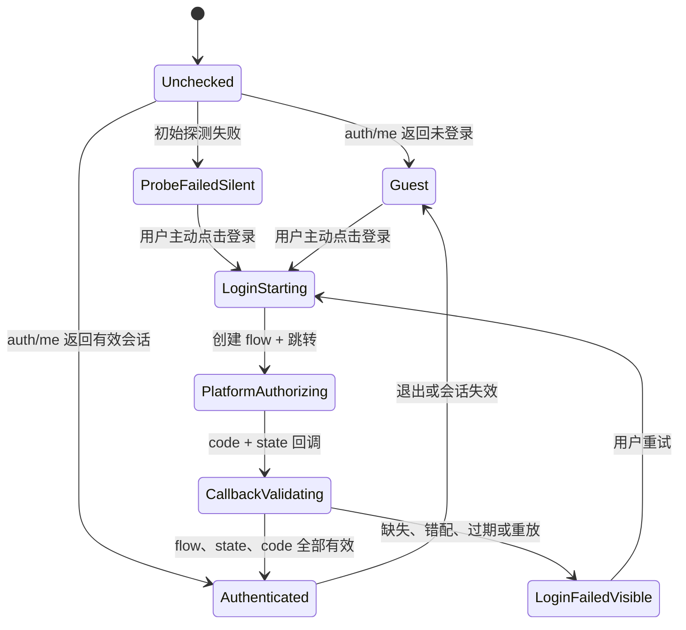
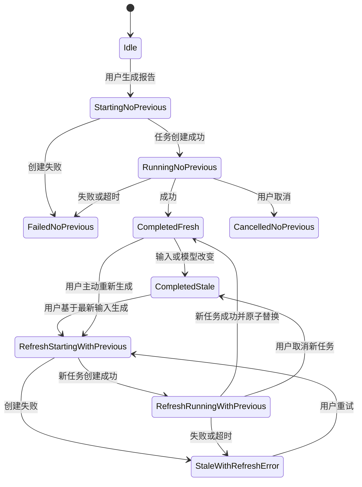
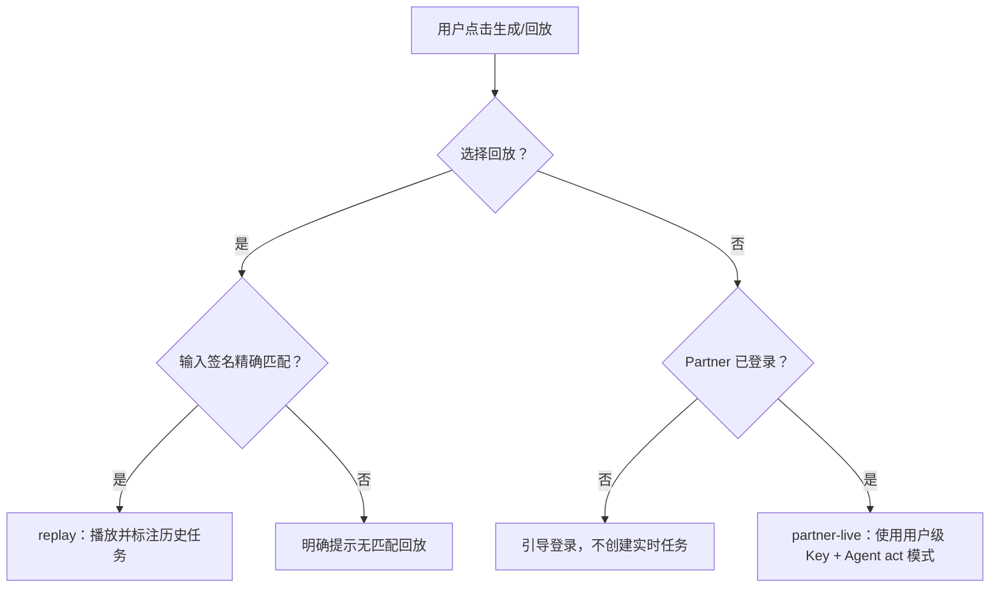

# Real Raise 产品状态机

> 状态：Active Target；当前实现部分偏离
> 版本：state-machine.v1
> 最后核验：2026-07-30

## 1. 为什么拆成三台状态机

过去把 `server-live`、是否登录、Judge、回放、报告完成状态压进少数布尔值，导致：

- 服务端存在被误解为 Judge 已开启；
- 删除 Judge UI 时误删模型选择和回放；
- 本地无 Worker 时仍发认证请求并显示线上错误；
- 输入变化后没有明确的“报告已过期”动作；
- 新任务失败时旧报告被清空。

从现在起独立建模：

1. **运行环境状态**：是否配置 Worker、当前 Origin。
2. **认证与执行路径状态**：guest / Partner，replay / partner-live。
3. **报告生命周期状态**：idle / running / completed-fresh / completed-stale 等。

## 2. 运行环境与可见路径矩阵

| 环境 | 认证 | 页面显示 | 可执行动作 |
| --- | --- | --- | --- |
| 未配置 Worker | 不适用 | 本地算表；若静态包可用则显示回放 | 本地计算、精确匹配回放 |
| 已配置 Worker | 检查中 | 本地算表；不显示全局认证错误 | 等待、查看回放 |
| 已配置 Worker | guest | 登录入口、回放入口 | 登录、查看回放 |
| 已配置 Worker | Partner 已登录 | 用户身份、模型选择、实时报告、回放 | 生成个人实时报告、查看回放、退出 |
| 已配置 Worker | 认证探测失败 | 本地算表、可重试登录；初始阶段静默 | 用户主动登录后才展示具体错误 |

不允许出现：

- BYOK；
- Judge UI；
- 未登录时项目 Key 实时任务；
- 因认证失败阻塞本地算表；
- 因隐藏 Judge 而隐藏模型选择或回放。

## 3. Partner SSO 状态机

不变量：

- 登录回调必须回到发起登录的允许 Origin。
- 本地发起不得固定跳回生产首页。
- API Key 只存在服务端会话存储。
- 初始探测失败与用户主动登录失败是两个 UI 状态。

## 4. 报告生命周期

### 状态与 UI

| 状态 | 旧报告 | 顶部主动作 |
| --- | --- | --- |
| `idle` | 无 | 登录后生成 / 查看回放 |
| `starting-no-previous` | 无 | 正在创建，可取消 |
| `running-no-previous` | 无 | 进度与取消 |
| `completed-fresh` | 显示 | 重新分析 |
| `completed-stale` | 显示并标注旧输入 | **基于最新输入生成新报告** |
| `refreshing-with-previous` | 保持显示 | 新报告生成中，可取消 |
| `stale-with-refresh-error` | 保持显示 | 重试；错误不得覆盖旧报告 |
| `failed-no-previous` | 无 | 登录、重试或回放 |

报告新鲜度比较必须至少包含：

- 输入签名；
- 收入输入模式；
- 支出输入模式；
- 城市与期间；
- 计算版本；
- 模型选择。

## 5. 执行路径状态机

回放和实时分析是两个显式动作，禁止自动把失败的实时任务伪装成成功回放。

## 6. 平台产物状态

| 状态 | 含义 | 页面可称为“平台完整报告” |
| --- | --- | --- |
| `verified` | 平台正文和必要产物读取完整 | 是 |
| `stream-fallback` | 只有事件流正文 | 否 |
| `deterministic-only` | 只有 Real Raise 凭证 | 否 |
| `failed-retryable` | 平台任务结束但必要证据不可得 | 否 |

## 7. 当前实现漂移

- `completed-stale` 已有部分签名检测，但入口埋在长报告底部。
- 刷新报告前会清空旧报告，不符合 `refreshing-with-previous`。
- Judge 后端仍存在，违反执行路径状态机。
- 四个 Replay 是旧口径供应商任务，不是当前 Prompt 的录制结果。
- 本地/生产 SSO 回跳曾发生 Origin 漂移；必须保留对应回归测试。
